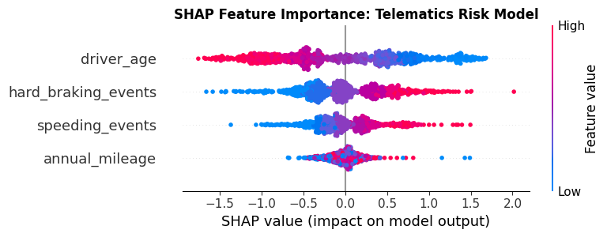

# 🚗 Telematics Risk Scoring: XGBoost, SHAP, & MLOps

*Bridging predictive power with regulatory explainability for modern insurance pricing.*

## The Context
In the insurance industry, deploying a "black box" machine learning model is a non-starter. If a telematics model flags a driver as high-risk, we must be able to explain *why* to both the customer and regulators. 

This repository demonstrates a production-ready approach to building, tracking, and explaining a telematics risk model, utilizing the exact stack required for scalable Applied ML.

## The Architecture
1. **Modeling (XGBoost):** Built a gradient-boosted tree to predict claim probability based on simulated driver behavior (hard braking, speeding, mileage).
2. **Experiment Tracking (MLflow):** Integrated MLflow to log hyperparameters, ROC-AUC metrics, and the model artifact. In a production environment, this prevents model drift and ensures reproducible deployments.
3. **Interpretability (SHAP):** Deployed SHAP (SHapley Additive exPlanations) to crack open the black box. 

### 📊 Model Explainability
Below is the SHAP summary plot generated from the test set. It clearly demonstrates that `hard_braking_events` drives the most risk, while older `driver_age` acts as a protective factor. 

---
*Stack: Python, XGBoost, SHAP, MLflow, Pandas, Scikit-Learn.*
